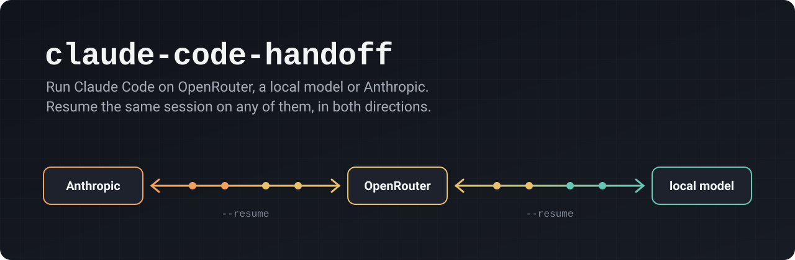

# claude-code-handoff

Run Claude Code on **OpenRouter**, on a **local model** (llama.cpp, llama-swap, vLLM, LiteLLM) or on **Anthropic**, and
`--resume` the same session on any of them. Start a task on Claude, continue it on a cheap OpenRouter model, finish it
on your own GPU, come back to Claude: the conversation follows.

- One small command per provider, nothing to keep running: the proxy lives for the length of the session.
- `/model` lists the provider's real model ids. No alias remapping, no config file.
- Python standard library only, under 900 lines including docs and help text.

## The two errors it fixes

Switching providers inside one session fails in both directions with stock Claude Code.

**Anthropic, then another provider.** A session started on Anthropic carries mid-conversation `system` messages
(`tool_addition`, `tool_removal`) and Anthropic-only fields (`diagnostics`, `thread`). OpenRouter rejects them
([anthropics/claude-code#31380](https://github.com/anthropics/claude-code/issues/31380)):

```
API Error: 400 {"type":"error","error":{"type":"invalid_request_error","message":"Invalid Anthropic Messages API request"}}
```

**Another provider, then Anthropic.** OpenRouter answers with a `request-id: gen-...` header, Claude Code stores it in
the transcript, and on resume it sends Anthropic that foreign id:

```
API Error: 400 diagnostics.previous_message_id: must be the `id` from a prior /v1/messages response (starts with `msg_`)
```

Both were reproduced with Claude Code 2.1.295 against the live APIs, and both pass with claude-handoff (see
[Verified](#verified)).

## Quick start

```bash
pipx install git+https://github.com/emoubarak/claude-code-handoff
# or, without installing: clone, then put bin/ on your PATH (or symlink bin/claude-handoff)
```

```bash
# OpenRouter
export OPENROUTER_API_KEY=sk-or-...
claude-handoff openrouter                                   # default model: deepseek/deepseek-v4.1-flash
claude-handoff openrouter -m openai/gpt-6-luna --models deepseek/deepseek-v4.1-flash

# A local Anthropic-compatible server (llama-server's default port is 8080)
claude-handoff local --url http://127.0.0.1:8080             # /model lists every model the server serves

# Back to Anthropic: repairs transcripts recorded through other proxies, then runs plain `claude`
claude-handoff anthropic
```

Anything after the launcher's own options goes to `claude` unchanged, so all the usual flags work:

```bash
claude-handoff openrouter --resume            # pick a session started anywhere
claude-handoff local --continue
claude-handoff openrouter -p "summarize the diff" --output-format json
```

Short aliases help if you switch often:

```bash
alias cco='claude-handoff openrouter'
alias ccl='claude-handoff local'
alias cca='claude-handoff anthropic'
```

## Commands

| Command | What it does |
|---|---|
| `openrouter` | Starts the proxy toward `https://openrouter.ai/api` and runs `claude` through it. Needs `OPENROUTER_API_KEY`. |
| `local` | Same toward a local server. Reads `/v1/models` to fill `/model`, and fails fast if the server is down. |
| `anthropic` | Repairs transcripts (below), then `exec claude` with your normal login. |
| `fix-transcripts [dir]` | Only the repair. Default folder: `$CLAUDE_CONFIG_DIR/projects` or `~/.claude/projects`. |
| `proxy --upstream URL` | The proxy alone, in the foreground, for other clients or a service manager. |

### Options and environment

`openrouter`

| Option | Environment | Default |
|---|---|---|
| `-m, --model` | `CLAUDE_HANDOFF_OPENROUTER_MODEL` | `deepseek/deepseek-v4.1-flash` |
| `--models a,b=Label` (extra entries in `/model`) | `CLAUDE_HANDOFF_OPENROUTER_MODELS` | none |
| `--route model=provider,...` (pin a model to one OpenRouter provider, no fallback) | `CLAUDE_HANDOFF_OPENROUTER_ROUTES` | none |
| `--dump FILE` | | off |

`local`

| Option | Environment | Default |
|---|---|---|
| `--url` | `CLAUDE_HANDOFF_LOCAL_URL` | `http://127.0.0.1:8080` |
| `-m, --model` | `CLAUDE_HANDOFF_LOCAL_MODEL` | first model the server lists |
| `--models` | | every model the server lists |
| `--no-thinking-toggle` | | toggle on |
| `--capabilities` | `CLAUDE_HANDOFF_LOCAL_CAPABILITIES` | `effort,thinking` |
| server API key | `CLAUDE_HANDOFF_LOCAL_API_KEY` | none |

Common: `CLAUDE_BIN` (path to `claude`, default: found on `PATH`), `CLAUDE_CONFIG_DIR` (honoured like Claude Code does).
Upstream errors are logged to `~/.local/state/claude-code-handoff/proxy.log`, never to the terminal, so they do not
break Claude Code's interface. `--dump` writes every request before and after rewriting, **full conversation
included**: keep it for debugging.

## How it works

```
claude ──▶ 127.0.0.1:<random port> (claude-handoff proxy, in-process) ──▶ OpenRouter / local server
```

The launcher starts the proxy on a free local port in a background thread, points Claude Code at it with
`ANTHROPIC_BASE_URL`, runs `claude` in the foreground and shuts everything down when it exits. On each
`/v1/messages` request the proxy:

1. **Normalizes the request** (`claude_handoff/compat.py`). `diagnostics` and `thread` are dropped. Each `system`
   message's text becomes a `<system-reminder>` block appended to the neighbouring user message (after any
   `tool_result` blocks, which must stay first); the `tool_addition` / `tool_removal` blocks are dropped, since the
   request's `tools` list already reflects them. Other requests pass through unchanged.
2. **Holds the API key.** Claude Code gets a placeholder token; the proxy sends the real key upstream. The key never
   reaches Claude Code's environment through this tool.
3. **Optionally pins a provider** on OpenRouter (`--route`): `provider: {"only": [...], "allow_fallbacks": false}`.
4. **Translates thinking for local models** (`local`, on by default). Claude Code expresses reasoning as `thinking` and
   `output_config.effort`; llama.cpp and vLLM chat templates (Qwen3 and others) only know
   `chat_template_kwargs.enable_thinking`. Thinking off or effort `low` gives `false`; anything else gives `true`.
   So Alt+T and the effort slider in `/model` keep working.
5. **Drops `request-id` headers on the way back.** Claude Code then records no `requestId` for these messages, and
   the session can return to Anthropic without any repair.

Streaming responses are relayed as they arrive.

**Transcript repair** (`claude_handoff/transcripts.py`) covers sessions recorded without this proxy, for example with
OpenRouter's own `ANTHROPIC_BASE_URL` setup. On resume, Claude Code sends Anthropic the id of the last assistant message
that has a `requestId`. The repair sets `requestId` to `null` on assistant messages whose id is not an Anthropic `msg_`
id, so Claude Code skips them. It edits the `.jsonl` in place, padded with spaces to the same length: no line moves,
and a session writing to the same file at that moment is not disturbed. `claude-handoff anthropic` runs it before
every launch, reading only files changed since the previous run (a few milliseconds).

**The model picker.** Each launcher passes `--settings` with `modelPicker.replaceBuiltInOptions`, so `/model` shows the
provider's real model ids. Picking one there makes Claude Code save it as your global default in `settings.json`; left
alone, your next plain `claude` would start on a model Anthropic does not know. The launcher puts the previous value
back on exit (only if the saved value is one of this provider's models). Subagents and background tasks that ask for
`haiku`, `sonnet` or `opus` go to the launch model through `ANTHROPIC_DEFAULT_*_MODEL`.

## Verified

Run on Linux with Claude Code 2.1.295, against the live services:

| Scenario | Result |
|---|---|
| Session started on Anthropic, resumed with `claude-handoff openrouter --resume` | Answered with the code word from the Anthropic turn. |
| The same request Claude Code sent, replayed straight to OpenRouter without normalizing | `400 Invalid Anthropic Messages API request` |
| The normalized request, replayed to OpenRouter | `200` |
| That session (Anthropic, then OpenRouter) resumed with `claude-handoff anthropic --resume` | Works; the OpenRouter turns were stored without `requestId`. |
| Session started on OpenRouter with the plain `ANTHROPIC_BASE_URL` setup, resumed with plain `claude --resume` | `400 diagnostics.previous_message_id ...` |
| The same session resumed with `claude-handoff anthropic --resume` | Repaired 3 messages, then answered from the OpenRouter turn. |
| Session resumed with `claude-handoff local` on llama-swap (Qwen3.6 35B-A3B, llama.cpp) | See below. |

The unit and integration tests (`python3 -m unittest discover -s tests -t .`) cover the normalizer, the proxy against
a fake upstream (rewrites, credentials, provider pinning, thinking toggle, streaming, errors), the transcript repair,
and the launchers with a fake `claude` binary (arguments, environment, settings restore, exit codes, SIGTERM, Ctrl+C).

## Limitations

- **Anthropic-compatible upstreams only.** OpenRouter, llama.cpp's `llama-server`, llama-swap, vLLM and LiteLLM speak
  the Messages API. A provider that only speaks OpenAI's format needs a translating gateway in front (LiteLLM, or
  claude-code-router).
- **Claude Code changes its request format often.** The normalizer handles what 2.1.295 sends. If a new release adds
  another Anthropic-only field, the error message names it; `--dump` shows the request.
- **Features that live on Anthropic's side** (claude.ai connectors, the advisor tool, Anthropic-hosted tools, usage
  limits display) are not available on another provider. Claude Code says so at startup.
- **Cost figures** shown by Claude Code (`total_cost_usd`, `/cost`) use Anthropic's prices for unknown models. Check
  the provider's dashboard for the real cost.
- **Quality is the model's.** A session moved to a small local model keeps its history, not its intelligence. Large
  sessions also need a context window that fits them (`llama-server -c`).
- Windows is untested.

## Compared to claude-code-router

[claude-code-router](https://github.com/musistudio/claude-code-router) is a full gateway: a desktop app and local
control plane for many coding agents and providers, with protocol conversion, routing rules, fallbacks, key pools and
request dashboards. Use it if you need any of that.

claude-handoff does one thing: run Claude Code on an Anthropic-compatible provider and keep sessions portable between
providers and Anthropic. No daemon, no config file, no dependencies. They can also be combined: put claude-code-router
behind `claude-handoff local --url ...`, or run `claude-handoff anthropic` / `fix-transcripts` to bring back sessions
recorded through any proxy that passed the provider's request ids back.

## Using the pieces on their own

```bash
# The proxy as a long-running service, for any Anthropic Messages client
OPENROUTER_API_KEY=... claude-handoff proxy --upstream https://openrouter.ai/api --port 8787 --api-key-env OPENROUTER_API_KEY
```

```python
from claude_handoff.compat import normalize
normalize(request_body)   # in place; harmless on requests that need nothing
```

With a LiteLLM proxy, add the callback (see [examples/litellm/config.yaml](examples/litellm/config.yaml)):

```yaml
litellm_settings:
  callbacks: claude_handoff.litellm_callback.handler
```

## Development

```bash
python3 -m unittest discover -s tests -t .
```

No third-party package is needed, except `litellm` for `claude_handoff/litellm_callback.py`.

## License

MIT
